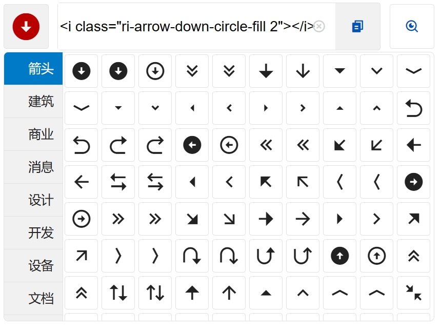

# MICON
### 图标插件

mIcon 是个开源图标选择插件。插件采用[remixicon](https://remixicon.com)开源图标库。可免费用于个人项目和商业项目，Enjoy it~


## 使用说明

### 基本用法

仓库地址
[https://github.com/mifan007/vue2-m-icon.git](https://github.com/mifan007/vue2-m-icon.git)





#### 安装引入

> **Note:** 

npm安装
```
npm install vue2-m-icon --save
```
> 入口文件引入 CSS
```
import 'vue2-m-icon/dist/mIcon.css'
```
```
Vue.use(micon)
```

#### 使用

```vue

<template>
    <m-icon @onChoose="choose" @onCopy="copy"></m-icon>
</template>
```

### 方法事件

选择事件
onChoose
示例数据
ri-arrow-go-back-fill

复制事件
onCopy
示例数据
```
<i class="ri-arrow-down-circle-fill 2"></i>
```
